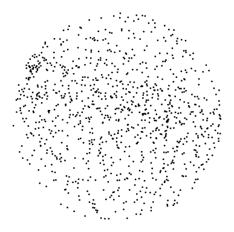
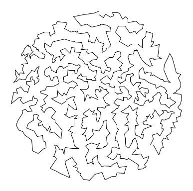
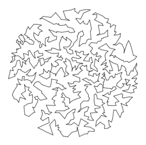

# ASSIGNMENT #0  

In this assignment, you will be implementing several heuristics to find a short path through a set of points. In the process, you will gain additional experience with linked lists, empirical performance analysis, and also learn about a famous problem in computer science.  

Given *N* points in the plane, the goal of a traveling salesperson is to visit all of them (and arrive back home) while keeping the total distance traveled as short as possible. Implement two greedy heuristics to find good (but not optimal) solutions *to the traveling salesperson problem* (TSP).  

  
*1,000 points*  

  
*optimal tour*  

**Perspective**. The importance of the TSP does not arise from an overwhelming demand of salespeople to minimize their travel distance, but rather from a wealth of other applications such as vehicle routing, circuit board drilling, VLSI design, robot control, X-ray crystallography, machine scheduling, and computational biology.  

**Greedy heuristics.** The traveling salesperson problem is a notoriously difficult combinatorial optimization problem. In principle, one can enumerate all possible tours and pick the shortest one; in practice, the number of tours is so staggeringly large (roughly N factorial) that this approach is useless. For large N, no one knows an efficient method that can find the shortest possible tour for any given set of points. However, many methods have been studied that seem to work well in practice, even though they are not guaranteed to produce the best possible tour. Such methods are called heuristics. Your main task is to implement the nearest neighbor and smallest increase insertion heuristics for building a tour incrementally. Start with a one-point tour (from the first point back to itself), and iterate the following process until there are no points left.  
* *Nearest neighbor heuristic:*  Read in the next point, and add it to the current tour *after* the point to which it is closest. If there is more than one point to which it is closest, insert it after the first such point you discover.  
* *Smallest increase heuristic:*  Read in the next point, and add it to the current tour *after* the point where it results in the least possible increase in the tour length. If there is more than one point, insert it after the first such point you discover.  

**Getting started.** Create a new Eclipse project and unzip [tsp.zip](tsp.zip) into the project directory. This file which contains various data files as well as some of the provided classes you will be using. Note in the assignment you only need to create the Tour.java data type, the rest of the programs are already completed and do not need to be modified.  

**Point data type.** The Point data type represents a point in the plane, as described by the following API:  
<pre>
public class Point (2D point data type)
---------------------------------------------------------------------------------------
       Point(double x, double y)    // create the point (x, y)
String toString()                   // return string representation
  void draw()                       // draw point using standard draw
  void drawTo(Point that)           // draw line segment between the two points
double distanceTo(Point that)       // return Euclidean distance between the two points
</pre>
Each Point object can return a string representation of itself, draw itself to standard draw, draw a line segment from itself to another point using standard draw, and calculate the Euclidean distance between itself and another point.  

**Tour data type.** Your task is to create a Tour data type that represents the sequence of points visited in a TSP tour. Represent the tour as a circular linked list of nodes, one for each point. Each Node will contain a Point and a reference to the next Node in the tour. Within Tour.java, define a nested class Node in the standard way:  
```
private class Node 
{
    private Point p;
    private Node next;
}
```

Your Tour data type must implement the following API:
<pre>
public class Tour
----------------------------------------------------------------------------------------------
       Tour()                                   // create an empty tour
       Tour(Point a, Point b, Point c, Point d) // create a 4 point tour a->b->c->d->a
  void show()                                   // print the tour to standard output
  void draw()                                   // draw the tour to standard draw
   int size()                                   // number of points on tour
double distance()                               // return the total distance of the tour
  void insertNearest(Point p)                   // insert p using nearest neighbor heuristic
  void insertSmallest(Point p)                  // insert p using smallest increase heuristic
</pre>
Each Tour object should be able to print its constituent points to standard output, draw its points to standard draw, count its number of points, compute its total distance, and insert a new point using either of the two heuristics. The first constructor creates an empty tour; the second constructor creates a 4-point tour and is intended to assist with debugging.  

**Input and testing.** The input format will begin with two integers *w* and *h*, followed by pairs of *x-* and *y-coordinates*. All *x-coordinates* will be real numbers between 0 and *w*; all *y-coordinates* will be real numbers between 0 and *h*. Many test data files are available. As an example, tsp1000.txt contains the following data:
```console
% more tsp1000.txt
775 768
185.0411 457.8824
247.5023 299.4322
701.3532 369.7156
563.2718 442.3282
144.5569 576.4812
535.9311 478.4692
383.8523 458.4757
329.9402 740.9576
...
254.9820 302.2548
```

After implementing Tour.java, use the client program NearestInsertion.java to read in the points from standard input, run the nearest neighbor heuristic; print the resulting tour, its distance, and its number of points to standard output; and draw the resulting tour to standard draw. SmallestInsertion.java is analogous but runs the smallest insertion heuristic.  

```console
% java NearestInsertion < tsp1000.txt
Tour distance = 27868.710634854797
Number of points = 1000
(185.0411, 457.8824)
(198.3921, 464.6812)
(195.8296, 456.6559)
(216.8989, 455.126)
(213.3513, 468.0186)
(241.4387, 467.413)
(259.0682, 473.7961)
(221.5852, 442.8863)
...
(264.57, 410.328)
```


```console
% java SmallestInsertion < tsp1000.txt
Tour distance = 17265.628155352584
Number of points = 1000
(185.0411, 457.8824)
(195.8296, 456.6559)
(193.0671, 450.2405)
(200.7237, 426.3461)
(200.5698, 422.6481)
(217.4682, 434.3839)
(223.1549, 439.8027)
(221.5852, 442.8863)
...
(186.8032, 449.9557)
```



**Analysis.**  Estimate the running time of your program as a function of the number of points *N*. Using the provided TSPTimer.java program (which relies upon Stopwatch.java), run the two heuristics for *N* = 1,000, and repeatedly double *N* until the execution time exceeds 100 seconds. **In the header of your** Tour.java, **provide the results of your experiments** for different values of N for both heuristics. For each heuristic, use the doubling hypotheses to determine the order of growth of the algorithm. Estimate the leading constant and finally provide a equation of the form T=aN<sup>b</sup> for each heuristic.  

---

**Do I need to follow the prescribed API?** Yes, we will be testing the methods in the API directly. If your method has a different signature or does not behave as specified, you will lose a substantial number of points. You may not add public methods to the API; however, you may add private methods (which are only accessible in the class in which they are declared).  

**What should my program do if the tour has 0 points?** The size() method should return 0; the distance() method should return 0.0; the show() method should write nothing to standard output; the draw() method should draw nothing to standard draw.  

**How do I represent positive infinity in Java?** Use Double.POSITIVE_INFINITY.  

**How long should my programs take to execute?** It should take less than a minute for the 13,509 city example (substantially less if you have a fast computer). If your code takes much much longer, try to discover why (think analysis of algorithms).  

**How can I produce an animation of the heuristic in action?** It's easy and instructive to watch the tour update after each insertion. Both SmallestInsertion.java and NearestInsertion.java take an optional command-line argument that puts the program into animation mode. *Note*: when timing your program, don't show the animation or else this may become the bottleneck.  

**What is the file** Tour$Node.class**?** When you declare a *nested class* like Node, the Java compiler uses the $ symbol to mark its name.  

**What is a NullPointerException?** You can get one by initializing a variable of type Node, say x, to null and then accessing x.next or x.p. This can happen in your insertion routine if you inadvertently break up the circular linked list.  

**When should I create a new linked list node with the keyword** new**?** To create a tour with *N* points, you should use new exactly *N* times with Node, once per invocation of insert(). It is unnecessary (and bad style) to use new with your list traversal variables since this allocates memory that you never use.  

**Can I use Java's built in** LinkedList **class?** Absolutely not! One of the main goals of this assignment is to gain experience writing and using linked structures. The Java libraries can only take you so far, and you will quickly discover applications which cannot be solved without devising your own linked structures.  

**What's the largest TSP tour ever solved exactly?** The "record" for the largest TSP problem ever solved exactly is a 85,900-point instance that arose from microchip design in the 1980s. It took over 136 CPU-years to solve. It is in the tsp.zip file, the optimal solution value is a little more than 71,000.  

---

**Extra credit.** Implement a better heuristic. For example, observe that any tour with paths that cross can be transformed into a shorter one with no crossing paths: add that improvement to your program. Here are some [other ideas](https://www.cs.princeton.edu/courses/archive/fall12/cos126/checklist/tspextra.html). Be warned, this is a difficult extra credit. We will award a special prize to whoever finds the shortest tour around the 1,000-point set. Be sure to describe in the header of your extra credit program the heuristics you added.

---

*This assignment was developed by Bob Sedgewick and Kevin Wayne, [Princeton's assignment page](http://www.cs.princeton.edu/courses/archive/spring11/cos126/assignments/tsp.html).
Copyright © 2000 [Robert Sedgewick](http://www.cs.princeton.edu/~rs/)*

---

This README was adapted from a page at Montana Tech: https://katie.cs.mtech.edu/classes/archive/s14/csci136/assign/tsp/
