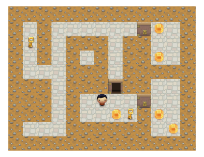
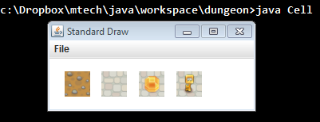
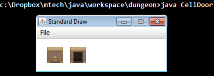
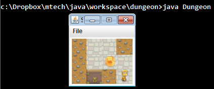

# ASSIGNMENT #1  
In this assignment, you will be making a game in which you wander around a dungeon. You will learn to use 2D array and develop a small class hierarchy using inheritance.	  

---

**Dungeon game.** Our hero is exploring a dungeon collecting gems. The dungeon has a bunch of locked doors that our hero needs to use keys to open. Our hero obviously can't walk through walls, unless of course it is a secret passage!  

**Program input.** The program reads in the dungeon using [StdIn.java](StdIn.java). Here is the [d0.txt](d0.txt) file:  
<pre>
13 10
3 10
W W W W W W W W W W W W W
W - W - - - - - - D - - W
W - W - W W W - W W - - W
W - W - S - S - W W - - W
W - - - W W W - W W W W W
W W W - W W W D W W - - W
W W W - W - - - - D - - W
W W W - W - - - - W - - W
W - - - W W W W W W - - W
W W W W W W W W W W W W W
</pre>
  

The first line contains the width and height of the dungeon in cells. The second line contains the number of keys and gems that will be randomly placed in the dungeon The remaining lines contain a character specifying what is at each location in the dungeon. Even though each cell is given by a single character, you should read them in using StdIn.readString() since this method will split the data on whitespace as expected. The string code for a cell is:  

* W = Wall, appears as dirt and the hero cannot pass through it.
* S = Secret passage, appears as dirt but the hero CAN walk here.
* - = Passageway, appears as stone floor, the hero can walk here.
* D = Door, appears as a closed door, the hero must have a key to open.

Your dungeon should appear on the screen oriented in the same way as the ASCII text version shown above. We think it is easiest if you setup your 2D array (let's call it map) so map[0][0] is the lower-left cell in the dungeon with the first index being the x-position and the second index being the y-position. So in the above map, the hero is at map[6][3], there is an open door at map[7][4], and so on.  

**Coordinates and pixels.** All image tiles in the game are 32 x 32 pixels. The number of tiles on the screen depends on the width and height read from the first line in the dungeon file. You should set your canvas size using StdDraw.setCanvasSize() so the entire dungeon can be shown. Recall that StdDraw's coordinate system has (0.0, 0.0) in the lower-left corner. It is easiest if you set StdDraw.setXscale() and StdDraw.setYscale() to match the pixel size of the canvas. This allows the various objects to draw themselves based on just knowing the tile resolution and their (x, y) indexes in the 2D array.  

**Gems and keys.** After your dungeon is created, it gets populated by gems and keys at random cell locations. Only cells that the hero can walk through are allow to have a gem or key. So passages and secret passages can have a gem or key, but doors and walls cannot. A cell can only contain a single gem or key. The cell (1, 1) where the hero starts should never have a gem or key. When the hero walks into a key, it is added to the hero's key total and the key.wav sound is played. When the hero walks into a gem, it is added to the hero's gem total and the gem.wav sound is played. Gems and keys should be drawn on top of the background tile.  

**Hero.** The hero always starts in the lower left at cell position (1, 1). The hero moves based on the following keys:  

* w = Walk north
* s = Walk south
* a = Walk west
* d = Walk east

The hero can only walk in the desired direction if the cell at that location is *passable*. If the cell is passable, the hero's position is updated and the walk.wav sound is played. If the cell is not passable, the hero remains in the current position and the wall.wav sound is played. You can use either boy.png or girl.png for the hero's image.  

**Doors.** All doors in the game start closed and locked. If the hero attempts to move into a locked door and the hero has at least one key, the door opens and the door.wav sound plays. Opening a door costs the hero one key. Once a door is open, it remains open.  

**Text output.** Besides the graphical display, the game also prints out text depending on what is going on. Here are the messages:  
```
Our hero walks north...
Can't go north!
Our hero walks south...
Can't go south!
Our hero walks west...
Can't go west!
Our hero walks east...
Can't go east!
You found a key, total keys = X
You found a gem, total gems = X
Used key to open door, keys left = X
You need a key for the door!
```
When the above messages should print should be obvious. The letter X should be replaced with the appropriate current count of keys or gems.  

**Classes.** You should start by downloading the file [dungeon.zip](dungeon.zip). This file contains the audio and image files as well as stub versions of the classes. The methods have javadoc style comments, you need to add instance variables and all method implementations. Here is a description of each class:  

* DungeonGame.java - Main program that runs the game. Responsible for reading in the dungeon control file using StdIn. Creates the Dungeon and Hero objects. Sets up the drawing canvas and coordinate size. The game continues forever.
* Cell - Represent a background tile in the dungeon. It knows things like: the image filename for this tile, whether the cell is passable, whether the cell contains a gem, and whether the cell contains a key. It can do things like: draw itself, add a key or gem to this location, see if the location is empty, and determine if the hero can move into it.
* CellDoor - Subclass of the Cell class. This object represents a door that can be either open or closed. It knows things like: the image filename when it is closed, the image filename when it is open, and whether it is currently open or closed. It can do things like: draw itself and determine if the hero can move into it (i.e. the door can be unlocked or is already open).
* Dungeon - Stores all the grid containing the entire dungeon. It knows things like: the grid of Cell and CellDoor objects that make up the dungeon and the size in pixels of a tile. It can do things like: set the contents of a specific cell location, add a key or gem to a random free location in the dungeon, and determine if the hero can move into a specific location.
* Hero - Represents the state of the hero in the game. It knows things like: an image filename, the current cell x- and y-index, tile size in pixels, number of keys, and number of gems. It can do things like: draw itself at its current location, use a key, return number of current keys, take a key, take a gem, and attempt to move based on a given character. This class is responsible for playing the sound effects in the game.

**Audio playback.** Use the [AudioFile.java](AudioFile.java) to play the sound effects. All audio playback can be handled by the Hero class since methods are always involved if a sound event happens. Since you are playing the same sound repeatedly, it makes sense for the Hero object to have an instance variable for each sound effect. Then whenever you need to play a sound, you can simply call the play() method on the appropriate variable.

**Main test methods.** The classes Cell, CellDoor, Dungeon, and Hero have provided test main() methods. This allows you to test most of the methods in a class independent of the other classes. You can modify or add to these test main() methods as you like (we ignore all main() methods except the one in DungeonGame.java). Here are our sample outputs using the provided test programs:  
Cell.java		
  

CellDoor.java		
  

Hero.java		
  

Dungeon.java		
  

You should also test with the bigger dungeons [d1.txt](s1.txt) and [d2.txt](d2.txt). Here are links to what the dungeons look like in our solution: [d1.png](d1.png), [d2.png](d2.png).  

---

**My dungeon is upside down.** What is going on? The drawing coordinate system has (0,0) in the lower-left. If you have your 2D array arranged to have [0][0] in the lower-left, you are going to need to transform the y-index appropriately when you read in the dungeon text file (since the first line of the dungeon is the upper-left cell).  

**Where did you get the graphics and sounds?** We cut out bits from some of the images provided in the set: [Danc's Miraculously Flexible Game Prototyping Tiles](http://www.lostgarden.com/2007/05/dancs-miraculously-flexible-game.html). The audio effects were obtained from [freesound.org](http://www.freesound.org/).  

**My tiles are all offset and appear in the borders of the drawing window.** Remember that the StdDraw.picture() method expects the *center* (x,y) position of the picture, not the lower-left corner. You need to adjust appropriately to get things to line up nicely.  

---

**Extra credit.** Make the game better. But please see the note below on how to submit your extra-credit creation. Be sure to submit your regular submission first and ensure it works per the assignment specifications.  

---

This README was adapted from a page at Montana Tech: https://katie.cs.mtech.edu/classes/archive/s14/csci136/assign/dungeon/
