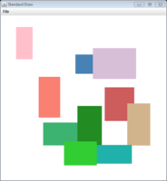
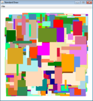

# Part 1: Creating block levels  

In the first part, you will be creating a command line application CreateBlocks.java that builds random level files for use by the game. The program generates a certain number of blocks (rectangles). The blocks are given a random width and height and a random (x, y) location. The block has to be contained in the unit box (0.0) - (1.0, 1.0). The color of each block is choosen randomly from a file of possible color values.  

**Command line arguments.** The program takes 3-5 command line arguments. If fewer then 3 command line arguments are given, it prints out the following helpful message and then terminates:  

<pre>
% java CreateBlocks
CreateBlocks <color file> <output file> <num blocks> [min size] [max size]
</pre>

The first argument is a file containing a list of colors. The first line in the color file is the total colors in the file. Each subsequent line has four columns describing a color: name of the color, red, green, and blue components. The components are given as an integer between 0 and 255. The first line is the total number of colors in the file:  
<pre>
114
IndianRed   205  92   92
LightCoral  240	 128  128
Salmon      250	 128  114
DarkSalmon  233  150  122
...
</pre>

The second argument is the filename which the program writes the generated data to. The third argument is a positive integer specifying the total number of random blocks to generate. If the fourth argument is given, it specifies the minimum width/height of a random block. If the fifth argument is given, it specifies the maximum width/height of a random block. The min and max size arguments must be in the interval (0.0, 1.0) (exclusive of the end points). The default min size is 0.05, the default max size if 0.25.  

**Reading colors.** You can use our example file [colors.txt](colors.txt) which contains 114 colors. You should create a static method Color [] loadColors(String filename) that reads the color definition file and returns an array of Java Color objects. This method should handle any exceptions caused by a failure to open the input file or parse the data in the file:  
* If there is a problem opening the file, print the error "Could not read color file:" followed by the filename.
* If there is a problem parsing the text, print the error "Could not parse color file:" followed by the filename.
* If either of the above happen, the method should return null and your main program should terminate (without generating a runtime error).

If everything went well, you should print out the number of colors read in, e.g. "Read in 114 colors."  

**Parsing the numeric arguments.** Your program should defend itself against invalid command line input as follows:  
* If the number of blocks is not a positive integer (or not an integer at all), print the error "Invalid number of blocks:" followed by the incorrect parameter and then terminate.  
* Next, you should open the output file for writing. If the open fails, you should print the error "Failed to open output file: " followed by the output filename and then terminate.  
* The minimum value for the random width/height is an optional argument. If present, it must be a double value in the range (0.0, 1.0), exclusive of the endpoints. If the double value is out of range, or the argument is not parseable as a double, you should print the error "Invalid min block size:" followed by the argument's value and then terminate.  
* The maximum value for the random width/height is the final optional argument. If present, it must be a double value in the range (0.0, 1.0), exclusive of the endpoints. If the double value is out of range, or the argument is not parseable as a double, you should print the error "Invalid max block size:" followed by the argument's value and then terminate.  
* If both the min and max values are successfully parsed, but the minimum is greater than the maximum, print an error such as "Invalid block size range: 0.5 > 0.4" and terminate.  

**Generating blocks.** Generate a random block and write a line to the output file. Each line in the output file should contain seven columns separated by whitespace: x-location, y-location, width, height, red, green, and blue. For example running "java CreateBlocks colors.txt out.txt 2" generated:
<pre>
0.6428429106060277	0.3951860163442299	0.22882435786316718	0.22606163038598928	199	21	133
0.18094746559427116	0.6966589213411483	0.1185965813651805	0.22550766462918148	218	112	214
</pre>

The width and height are randomly chosen using in the (min, max) range specified by either the default (0.05, 0.25) or by the command line arguments. The x-position and y-position are the center of the rectangle representing the block. The (x, y) position is chosen randomly but such that the entire block is inside the unit box (i.e. no part of the block extends outside of (0.0) - (1.0, 1.0). The RGB color triplet is given by one of the triplets from a randomly selected color from the read in set of colors (i.e. the three RGB integer values appear together on one of the lines in the color text file).  

**Drawing.** After generating each random block, draw the block using StdDraw.  

**Example runs:**  

<pre>
% java CreateBlocks missing.txt
CreateBlocks <color file> <output file> <num blocks> [min size] [max size]
</pre>

<pre>
% java CreateBlocks missing.txt out.txt 10
Could not read color file: missing.txt
</pre>

<pre>
% java CreateBlocks StdDraw.class out.txt 1 0
Could not parse color file: StdDraw.class
</pre>

<pre>
% java CreateBlocks colors.txt . 10
Read in 114 colors.
Failed to open output file: .
</pre>

<pre>
% java CreateBlocks colors.txt out.txt -2
Read in 114 colors.
Invalid number of blocks: -2
</pre>

<pre>
% java CreateBlocks colors.txt out.txt 0
Read in 114 colors.
Invalid number of blocks: 0
</pre>

<pre>
% java CreateBlocks colors.txt out.txt ick
Read in 114 colors.
Invalid number of blocks: ick
</pre>

<pre>
% java CreateBlocks colors.txt out.txt 10 yo
Read in 114 colors.
Invalid min block size: yo
</pre>

<pre>
% java CreateBlocks colors.txt out.txt 10 0.0
Read in 114 colors.
Invalid min block size: 0.0
</pre>

<pre>
% java CreateBlocks colors.txt out.txt 10 0.1 -0.2
Read in 114 colors.
Invalid max block size: -0.2
</pre>

<pre>
% java CreateBlocks colors.txt out.txt 10 0.1 0.05
Read in 114 colors.
Invalid block size range: 0.1 > 0.05
</pre>

<pre>
% java CreateBlocks colors.txt out.txt 10 0.1 no
Read in 114 colors.
Invalid max block size: no
</pre>

<pre>
% java CreateBlocks colors.txt out.txt 10 0.1 0.3
Read in 114 colors.
Creating 10 random blocks.
</pre>

<pre>
% java CreateBlocks colors.txt out.txt 1000 0.01
Read in 114 colors.
Creating 1000 random blocks.
</pre>

---

This README was adapted from an assignment page at Montana Tech: https://katie.cs.mtech.edu/classes/archive/s14/csci136/assign/blocks/
