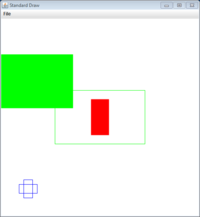
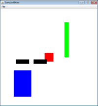

# Part 2: Blocks game  

You will create a game in which you drag blocks around trying to minimize the height of the stack. The game will load a text level file created by CreateBlocks.  

You need to develop three Java classes:  
* Block.java - Class that represents a single block in the game.
* Blocks.java - Class that stores a collection of Block objects.
* BlockGame.java - Class that implements that main() method that plays the game.

You need to create these files from scratch. Here is the API you should implement for the Block class:  
<pre>
public class Block
--------------------------------------------------------------------------------------------------------------------
public Block(double x, double y,                  // Create a block at the given (x,y) center position, with the given 
             double width, double height,         // width, height, and RGB color value
             int red, int green, int blue)  
public void draw(boolean filled)                  // Draw the block in either filled or outline form
public double getLeft()                           // Get the leftmost coordinate of the block
public double getRight()                          // Get the rightmost coordinate of the block
public double getTop()                            // Get the topmost coordinate of the block
public double getBottom()                         // Get the bottommost coordinate of the block
public boolean inside(double x, double y)         // See if the point (x,y) is inside the box (including on the edge)
public boolean outsideUnitBox()                   // Check if the block extends outside the unit box
public boolean intersects(Block other)            // Check if this block intersects with another block
public void move(double x, double y)              // Move the block to a new (x,y) position
public void rotate()                              // Rotate the block by 90 degrees
</pre>
Here is the API you should implement for the Blocks class:  
<pre>
public class Blocks
--------------------------------------------------------------------------------------------------------------------
public Blocks(String filename)                    // Create a new collection of blocks based on a text file 
public void draw()                                // Draw all the blocks in the collection
public int size()                                 // Find out how many blocks are in the collection
public Block removeAtLocation(double x, double y) // Return block at (x,y) removing from collection, returns null if no block at (x,y)
public void add(Block block)                      // Add the given block to the collection
public double height()                            // Return the height of the topmost block in the collection
public boolean validLocation(Block block)         // Check if a Block's location is valid (doesn't intersect other blocks or go outside unit box)
</pre>

**Input file.** The BlockGame program takes one command line option, the filename of the text file created by CreateBlocks. If no command line options are given, the program should print "BlockGame <blocks file>" and terminate.  

**Coordinate system and screen.** In this assignment, we will stick with the default StdDraw coordinate system. So (0.0, 0.0) is the lower-left corner and (1.0, 1.0) is the upper-right corner. You can also leave the canvas as the default 512 x 512 pixel size. You should draw a black square around the unit box showing the valid playing area.  

**Intersection of blocks.** Two blocks intersect if any portion of the two axis-aligned rectangles overlap. It is actually easier to solve for when the two blocks do NOT overlap. This occurs if one rectangle is completely to the right of the other, or is to the left, or above, or below. For details, see [here](http://nerdparadise.com/tech/interview/intersectrectangles/).  

**Moving blocks.** In order to move a block, the user most put the mouse cursor over a block. If the mouse cursor is over multiple overlapping blocks, the block that is visually on top should be the one grabbed. When selected, the block immediately "snaps" to be centered on the mouse location. As long as the user holds the down the mouse button, the block will be dragged around. While dragging a block, it appears as a filled rectangle whenever the block could be placed at the current location. If a block intersects another block or extends outside the unit box, it should appear as the outline of a rectangle. When the mouse button is released *and* the block is in a valid location, it is dropped at the new location. If the mouse button is released at an invalid location, then the block continues to be dragged around until it arrives at a valid location.  

**Rotating blocks.** If the user is currently dragging a block (i.e. holding down the mouse button) and the user presses the spacebar, you should rotate the block 90 degrees. The block should draw itself as filled or outlined depending on whether the new rotated block is in a valid game location.  

**Height.** At the top of the screen, the current height of the blocks should be displayed. A lower height is a better "score". The height should be displayed to three decimal places of precision. This is the maximum y-coordinate of the top side of any block in the game. If the user is currently dragging a block that is above all the other blocks, the height text should change to reflect the dragged block's current location.  

**Testing your classes.** Here is the code we used to test our Block class along with sample output:  
<pre>
public static void main(String [] args)
{
   Block b1 = new Block(0.5, 0.5, 0.1, 0.2, 255, 0, 0);
   Block b2 = new Block(0.1, 0.1, 0.05, 0.1, 0, 0, 255);
   Block b3 = new Block(0.5, 0.5, 0.5, 0.3, 0, 255, 0);
		
   b1.draw(true);
   b2.draw(false);
   System.out.println("b1 " + b1.getLeft() + " " + b1.getTop() + " " + b1.getRight() + " " + b1.getBottom());		
				
   b2.rotate();
   b2.draw(false);
   b3.draw(false);
						
   System.out.println("b1 <-> b2 " + b1.intersects(b2) + " " + b2.intersects(b1));
   System.out.println("b1 <-> b3 " + b1.intersects(b3) + " " + b3.intersects(b1));
		
   System.out.println("b3 outside " + b3.outsideUnitBox());
   System.out.println("(0.6, 0.6) in b3 " + b3.inside(0.6, 0.6));
   System.out.println("(0.8, 0.8) in b3 " + b3.inside(0.8, 0.8));
		
   b3.move(0.1, 0.7);
   b3.draw(true);
   System.out.println("b3 outside " + b3.outsideUnitBox());			
   System.out.println("b1 <-> b2 " + b1.intersects(b2) + " " + b2.intersects(b1));
   System.out.println("b1 <-> b3 " + b1.intersects(b3) + " " + b3.intersects(b1));
}
</pre>

<pre>
b1 0.45 0.6 0.55 0.4
b1 <-> b2 false false
b1 <-> b3 true true
b3 outside false
(0.6, 0.6) in b3 true
(0.8, 0.8) in b3 false
b3 outside true
b1 <-> b2 false false
b1 <-> b3 false false
</pre>

Here is the code we used to test our Blocks class along with sample output:  
<pre>
public static void main(String [] args)
{
	Blocks blocks = new Blocks("bogusfilename.txt");
	
	blocks.add(new Block(0.5, 0.5, 0.1, 0.1, 255, 0, 0));
	blocks.add(new Block(0.2, 0.2, 0.2, 0.3, 0, 0, 255));
	blocks.add(new Block(0.7, 0.7, 0.05, 0.4, 0, 255, 0));
	
	blocks.draw();
	System.out.println("size   = " + blocks.size());
	System.out.println("height = " + blocks.height());
	
	Block b1 = new Block(0.4, 0.45, 0.15, 0.05, 0, 0, 0);
	Block b2 = new Block(0.2, 0.45, 0.15, 0.05, 0, 0, 0);
	b1.draw(true);
	b2.draw(true);
	System.out.println("b1 valid = " + blocks.validLocation(b1));
	System.out.println("b2 valid = " + blocks.validLocation(b2));
	
	Block current = blocks.removeAtLocation(0.0, 0.0);
	System.out.println("current  = " + current);
	System.out.println("size now = " + blocks.size());
	
	current = blocks.removeAtLocation(0.5, 0.5);
	System.out.println("current = " + current);		
	System.out.println("size now = " + blocks.size());
}
</pre>

<pre>
Could not find blocks file: bogusfilename.txt
size   = 3
height = 0.8999999999999999
b1 valid = false
b2 valid = true
current  = null
size now = 3
current = Block@42472d48
size now = 2
</pre>

Note: we got Block@42472d48 when we ran our program, but you'll get something different after the @ sign every time you run it.

---

**I started dragging a block that was intially on top of another one and it was impossible to place it anywhere. Is that suppose to happen?** Yes, this can happen since we didn't prevent overlaping blocks in CreateBlocks. So some levels may require careful choice of block order or may be in fact be impossible.  

**How did you get the height to print to just three decimal places?** We used String.format("%.3f", value) to return a String representing a floating-point value to three decimal places.  

**What imports do I need for file I/O and colors?** To read and write from text files, you'll get everything you need (and more) by adding import java.io.*, import java.util.*, and import java.awt.*  

---

This README was adapted from an assignment page at Montana Tech: https://katie.cs.mtech.edu/classes/archive/s14/csci136/assign/blocks/
