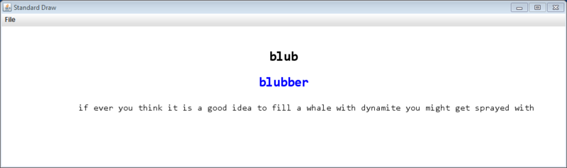

# ASSIGNMENT #3 - Predictive Keyboard  

In this assignment, you will be building a predictive keyboard. The keyboard learns to make predictions by text given at startup and by things the user types into the program. As users type, the program predicts the most likely word given the currently entered word prefix. So for example, if the user has typed *th*, the keyboard will probably predict the.  

You will learn how to use the Java HashMap collection which is crucial to making the keyboard's learning and predictions fast and efficient.	

---

**Language modeling 101.** Our predictive keyboard will make use of a very simple model of language, a *unigram language model*. Our keyboard will keep track of every unique word it has seen. For each unique word, it will count how many times that word has occurred. A simple *maximum likelihood* estimate for the unigram probability of a word is to take the number of times you've seen that word occur divided by the total number of words you've encountered. For example, here is a small bit of text:  

<pre>The cat is in the corner of their garage.</pre>  

There are 9 total words in our text. Ignoring case and punctuation, the word *the* appears twice. The unigram probability of the is thus P(the) = 2/9. The unigram probability of *cat* is P(cat) = 1/9. The other six words: *is, in, corner, of, their, garage* all also have a probability of 1/9. If a word has never been seen, its probability is zero: P(zebra) = 0/9 = 0.0.  

Given the data, if the user were to type in *c*, both cat and corner are equally likely. But if they type *ca*, we would predict *cat*, while if they typed *co* we'd predict *corner*. If the user typed *ci*, we would make not prediction (since none of our words start with *ci*).  

**Files.** Start by downloading [keyboard.zip](keyboard.zip). This contains the stub files for the two classes you will be developing. It contains two support classes Stats.java and StdDraw.java. The Stats class is used by our test method to track elapsed time and memory. It also contains some text files for use in training your model:  
* moby_start.txt - The first paragraph from Moby-Dick (202 words).
* moby_end.txt - The last two paragraphs from Moby-Dick (232 words).
* mobydict.txt - The entire book Moby-Dick (209K words).
* wiki_200k.txt - 200,000 sentences from Wikipedia (3.8M words).

**Word and probability class.** In this assignment we need a class to represent a word and its unigram probability. We have given you a completed version of DictEntry, *you shouldn't need to modify this file*. We won't be using the audio functionality of DictEntry in this assignment (though you could imagine it would be handy if your program was to be used as a [voice output communication aid](http://en.wikipedia.org/wiki/Speech_generating_device)). Here is the API to DictEntry:  
<pre>
public class DictEntry
------------------------------------------------------------------------------------------------------------------------------
         DictEntry(String word, double prob)                  // create a new entry given a word and probability
         DictEntry(String word, double prob, String filename) // create a new entry given a word, probability, and audio filename
  String getAudio()                                           // getter for audio filename
  String getWord()                                            // getter for the word 
  double getProb()                                            // getter for the probability
 boolean matchPattern(String pattern)                         // does this word match the given pattern?
 </pre>
 
**Prediction class.** The brains of this whole operation is the class WordPredictor. This class learns how to make word predictions based on being shown training data. It can learn from all the words in a file (via the train() method) or from a single individual word (via the trainWord() method). After new training data is added, the build() method *must* be called so the class can recompute the most likely word for all possible prefixes. Here is the API for the WordPredictor class:  

<pre>
public class WordPredictor
-----------------------------------------------------------------------------------------
      void train(String trainingFile) // train the unigram model on all the words in the given file
      void trainWord(String word)     // train on a single word, convert to lowercase, strip anything not a-z or '
      long getTrainingCount()         // get the number of total words we've trained on
       int getWordCount(String word)  // get the number of times we've seen this word (0 if never)
      void build()                    // recompute the word probabilities and prefix mapping
 DictEntry getBest(String prefix)     // return the most likely DictEntry object given a word prefix
</pre>

**Training the model.** Model training occurs in the train() and trainWord() methods. train() should parse out each word in the specified file on disk. If the file cannot be read, it should print out an error, "Could not open training file: file.txt". All training words are converted to lowercase and stripped of any characters that are not a-z or the single apostrophe. During training, you need to update the instance variables:  
<pre>
private HashMap<String, Integer> wordToCount;
private long total;
</pre>

The wordToCount instance variable is a map where the keys are the unique words encountered in the training data. The values are the integer count of how many times we've seen each word in the data. Only words seen in the training data will have an entry in the HashMap. The total instance variable tracks how many words of training data we have seen. That is, total should equal the sum of all integer counts stored in your map. Training is cumulative for repeated calls to train() and trainWord(), so you just keep increasing the counts stored in your wordToCount map and your total count of training words.  

**Making predictions.** The class needs to be able to predict the most probable word for a given word prefix give the statistics found during training. For example, after training on mobydick.txt, if the user types the prefix *wh, wha, whal or whale,* the most likely word is *whale*. The job of mapping word prefix strings to the most probable dictionary entry falls to the third instance variable:  
<pre>
private HashMap<String, DictEntry> prefixToEntry;
</pre>

A Map collection in Java can map multiple keys to the same value. This is exactly what we need in this case since a set of strings (such as *wh, wha, whal and whale*) may all need to map to a single DictEntry object. You need to ensure that each prefix maps to its most likely word. So even if the word *thespian* was encountered first in the training data, for any sensible training text, *th* should probably map to *the* and not *thespian*.  

Every time the build() method is called, you need to re-initialize the contents of prefixToEntry. This ensures that you take into account any new words or updated counts present in wordToCount. Here is an overview of the algorithm you should be aiming for in build():  

* Loop over all possible (key, value) pairs in wordToCount. For example of how to do this, see the [HashMapIter.java](https://katie.cs.mtech.edu/classes/archive/s14/csci136/examples/HashMapIter.java) example program.
  * For each (key, value) pair:
    * Calculate the probability of that word given its count and the number of training words. Create a new DictEntry object representing this word and its probability.
    * Loop over all possible prefixes of the word. That is from a prefix of only the first letter to a "prefix" that is the entire word.
      * For each prefix, if the DictEntry object you just created has a probability strictly greater than what is currently stored for that prefix, replace the old value (a DictEntry object) with the new object.

This results in our map containing a mapping from every valid prefix of every training word to the most probable complete word under the unigram language model. Your getBest() method can be a one-liner!  

**Testing the prediction class.** We have provided you with a stub version of PredictiveKeyboard with an extensive test main() method. The first part of main() test out your training routines, while the second half focuses on the prediction part. Note that the exact time and memory shown at the end are system dependent (though you shouldn't be orders of magnitude off). Here is our output:  
<pre>
% java WordPredictor

bad1 = null
training words = 202
bad2 = null
Could not open training file: thisfiledoesnotexist.txt
training words = 202

count, the = 10
count, me = 5
count, zebra = 0
count, ishmael = 1
count, savage = 0

count, the = 32
count, me = 5
count, zebra = 0
count, ishmael = 1
count, savage = 1

a -> and	0.03917050691244239	
ab -> about	0.004608294930875576	
b -> bird	0.004608294930875576	
be -> before	0.002304147465437788	
t -> the	0.07373271889400922	
th -> the	0.07373271889400922	
archang -> archangelic	0.002304147465437788	
training words = 434

before, b -> bird	0.004608294930875576	
before, pn -> null
after, b -> bird	0.004576659038901602	
after, pn -> pneumonoultramicroscopicsilicovolcanoconiosis	0.002288329519450801	
training words = 437

a -> and	0.030079417288752873	
ab -> about	0.001472985727769356	
b -> but	0.008580499385064212	
be -> be	0.0048908846494866	
t -> the	0.06757143265738066	
th -> the	0.06757143265738066	
archang -> archangel	3.3368608719694154E-5	
training words = 209778
elapsed (s)           : 0.459
heap memory used (KB) : 30245

Random load test:
elapsed (s)           : 3.447
heap memory used (KB) : 86955
Hit % = 30.0537
</pre>

**Predictive keyboard program.** Product marketing has mocked up a screenshot for your new predictive keyboard product:

Here is a list of product marketing's long-winded and pedantic requirements:  
* Program takes 0 or more command line arguments. Each command line arguments specifies a text file to train on.
* Program window should be 1024 x 256 pixels.
* All text should be displayed in the Consolas font.
* The word currently being typed should appear centered at the top of the window. The text should be black and in 24 point font.
* The current best word prediction (if any), should appear centered in the window below the typed word. The text should be blue and in 24-point font.
* The text written thus far should appear at the bottom of the screen. The text should be right justified. The text should be black and in 16-point font.
* If the current word is blank, no prediction is displayed.
* If the current word is a prefix of a known word, display the most probable known word in the center.
* If the user types a space and the the current word is not blank, output the current word to the bottom and reset the current word to blank.
* If the user types a space and the the current word is blank, do nothing.
* If the user hits return and a prediction is currently available, output the predicted word and reset the current word to blank.
* If the user hits return and a prediction is not available, do nothing.
* If the user hits backspace, delete one letter from the currently typed word. If the current word is empty, don't do anything (i.e. you can't edit words once they are output).
* If the user hits a key besides a-z, single apostrophe, return or backspace, do nothing.
* For every word completed (via hitting space or return), the word is added to the training data and the predictions are updated to reflect this.

In particular, note the last requirement. This requirement means you can in fact start your keyboard with no data and it will learn words as you go. You can also train the model on some data by providing file(s) on the command line and your keyboard will still learn new words and update its model based on what it sees you type. How cool is that? This program should sell like hot cakes! The video to the right shows the keyboard starting without any training data. Notice how it eventually starts making predictions based on what it has seen the user type.  

---

**Do I need to follow the prescribed APIs?** Yes. You may not add public methods to the API; however, you may add private methods (which are only accessible in the class in which they are declared). For example, in our PredictiveKeyboard class, we made a private helper method private String normalize(String text). This method's converts a word of training data and make it lower case and strip any invalid characters. This helped simplify our trainWord() method.  

**I seem to have repeated code in my train() and trainWord() methods. Is that okay?** No, recall our mantra: *Repeated Code is Evil™*. You should probably refactor your code so the train() method makes use of the trainWord() method.  

**How do I test if a HashMap contains a certain key value?** You can use the containsKey() method to check whether a particular key exists. For further details, check out the HashMap documentation.  

**How do I test a char variable to see if it is the backspace key?** The backspace key is \b.  

**How do I test a char variable to see if it is the return key?** The return key is \n.  

**How do I represent the char value for a single apostrophe?** Yeah that tripped us up at first too. You need to *escape* the apostrophe with a backslash in the char literal since apostrophes are used to start and end the literal. So for example this code (ch == '\'') tests if the char variable ch is equal to an apostrophe.  

**Why did you use a long type for the total count of training words but an Integer for the HashMap value?** Well we used a long since we were worried somebody might train our keyboard on over 2^31 - 1 (a little more than 2 billion) words of data. We used an Integer instead of a Long in the HashMap since even with a huge amount of training data, it is unlikely we'd see any particular word over 2 billion times. This saved us memory in our HashMap instance variable.  

**Is there a way to clear out all the data in a HashMap so I can re-fill it based on new training data?** Yes. You can call the clear() method on the HashMap object. You could also reinstantiate the object and let the Java garbage collector deal with the old map. Probably the earlier is somewhat more efficient.  

---

**Extra credit.**
* Level 1. Create a more advanced predictive keyboard that can show the top N possible completions for the current word. The value for N is passed as the first argument on the command-line. The interface should show up to N words that are consistent with the currently typed letters. Less than N words may be shown for some prefixes. The letters should be labeled with the numbers 0 up to N-1. If the user hits a number, the coorresponding predictions (if any) is output. The return key should select the best prediction. The video to the right shows our version trained on the wiki_200k.txt using 5 predictions.
* Level 2. Make your predictions depend on not only the current word prefix, but also on the prior word (i.e. a bigram language model). Note that you might not always be able to make a prediction using the prior word (e.g. at the start of the sentence or if the prior word was never seen in the training data). This is a common problem in language modeling called sparsity. One way to handle this problem is to backoff to a lower-order language model. In your case, this would mean backing off to the unigram model which can always make a prediction as long as the current prefix is consistent with some word in the training data.

---

This README was adapted from an assignment page at Montana Tech: https://katie.cs.mtech.edu/classes/archive/s14/csci136/assign/keyboard/
