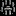

# Extra Credit  

Contains additional tiles from Ultima 4:  
* 
* 
* 
* 
* 

Conatins four extra maps:
2 versions of 8-bit Ganon from the Legend of Zelda
* [ganon.txt](ganon.txt)
* [ganon2.txt](ganon2.txt)
1 Jhelom (world map area) from Ultima 4
* [jhelom.txt](jhelom.txt)
1 Moonglow (world map area) from Ultima 4
* [moonglow.txt](moonglow.txt)

--- 

**Extra credit level 1.** Create interesting new level(s).

**Extra credit level 2.** Enhance your lighting algorithm so that opaque objects block what can be seen. Something along the lines of my version shown on the right.

**Extra credit level 3.** Make it so some tile types can be light sources of a given radius. On the video on the right, I made lava tiles generate light out to a distance of 2.5. The light should obey the same occlusion algorithm as for the Avatar's torch.

---

This README was adapted from an assignment page at Montana Tech: https://katie.cs.mtech.edu/classes/archive/s14/csci136/assign/ultima/
