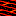
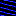
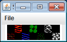
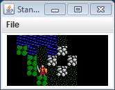
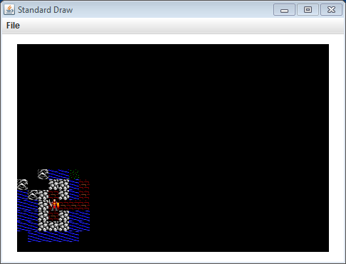

# Ultima 0  

In this assignment, you will be creating the starting point for a tile-based role playing game, similar to the famous Ultima series. You will be creating a recursive algorithm to handle a variable power torch that lights your Avatar's surroundings. You will reuse the algorithm to make sections of	  

---

**Basics.** The game is played on a rectangular grid of tiles. The grid of tiles is specified in a flat text file. Your Avatar moves around by moving in one of the cardinal directions (north, south, east or west). The Avatar is not allowed to move through certain features (e.g. water or mountains). It is nighttime, but luckily your Avatar has a variable brightness torch. The torch cannot see through certain features (e.g. mountains, stone walls).

**Files.** The file ultima.zip contains the set of graphics tiles we'll be using in this assignment. We have included a bunch of extra graphics in case you need them for an extra-credit creation. It also contains stub versions of the programs Tile, World, Avatar. We have given you a fully functional version of the main game program Ultima.java.  

**Avatar.** A Avatar object represents a player in the game. An Avatar knows things like its current (x,y) position in the world and the current power of the Avatar's torch. The (x,y) position are indexes, so (0,0) is the lower-left tile, (1, 0) is one tile to east, (0, 1) is one tile to the north, and so on. An Avatar can do things like get its x/y position, change its location, get its current torch power, increase/decrease its torch power, and draw itself. An Avatar's torch has a minimum torch radius of 2.0. The torch power changes in increments of 0.5. The torch starts with a default radius of 4.0.  

Your Avatar data type must implement the following API:  

<pre>
public class Avatar
----------------------------------------------------------------------------------------
            Avatar(int x, int y)      // Create a new Avatar at index position (x,y)
        int getX()                    // Get the current x-position of the Avatar
        int getY()                    // Get the current y-position of the Avatar
       void setLocation(int x, int y) // Update the position of the Avatar to index (x,y)
     double getTorchRadius()          // Get the current torch radius   
       void increaseTorch()           // Increase torch radius by 0.5
       void decreaseTorch()           // Decrease torch radius by 0.5, minimum is 2.0
       void draw()                    // Draw at the current position
</pre>

We have provided a test main for Avatar. Here is our output:  

</pre>
% java Avatar
5 5 4.0
1 4 4.0
1 4 4.5
1 4 4.0
1 4 3.5
1 4 3.0
1 4 2.5
1 4 2.0
1 4 2.0
</pre>

**Tile.** A Tile object represents an individual position in the Ultima world. All tiles are the same size: 16 by 16 pixels. Tiles know things like what type of tile it is and whether it is currently lit by the torch. A tile can do things like tell people about whether it is lit, set whether it is lit or not, draw itself, determine if the Avatar can walk through it, and determine if light passes through it. Tiles should default to not being lit.  

Here are the details of the types of tiles your program needs to support:  
<table border="1" cellspacing="0" cellpadding="3">
<tr><td>Name</td><td>Filename</td><td>Image</td><td>Opaque?</td><td>Passable?</tt><td>String code</td></tr>
<tr><td>Brick floor</td><td><tt>brickfloor.gif</tt></td><td></td><td>No</td><td>Yes</tt></td><td>B</td></tr>
<tr><td>Lava</td><td><tt>lava.gif</tt></td><td></td><td>No</td><td>Yes</tt></td><td>L</td></tr>
<tr><td>Water</td><td><tt>water.gif</tt></td><td></td><td>No</td><td>No</tt></td><td>W</td></tr>
<tr><td>Forest</td><td><tt>forest.gif</tt></td><td></td><td>Yes</td><td>Yes</tt></td><td>F</td></tr>
<tr><td>Grasslands </td><td><tt>grasslands.gif</tt></td><td></td><td>No</td><td>Yes</tt></td><td>G</td></tr>
<tr><td>Mountains</td><td><tt>mountains.gif</tt></td><td></td><td>Yes</td><td>No</tt></td><td>M</td></tr>
<tr><td>Stone wall</td><td><tt>stonewall.gif</tt></td><td></td><td>Yes</td><td>No</tt></td><td>S</td></tr>
</table>

If a tile is not lit, you can draw it using the supplied blank.gif image. Here is the API you should implement for the Tile class:  
<pre>
public class Tile
-----------------------------------------------------------------------------------------
            Tile(String code)        // Create a new tile based on a String code
    boolean getLit()                 // Return whether this Tile is lit or not
       void setLit(boolean value)    // Change the lit status of this Tile
       void draw(int x, int y)       // Draw at index position (x, y)
    boolean isOpaque()               // Does this type of Tile block light?
    boolean isPassable()             // Can the Avatar walk on this Tile?
</pre>

We have provided a test main for Tile. Here is our output:  

<pre>
% java Tile
0 0 : lit true	opaque false	passable true
0 1 : lit false	opaque false	passable true
1 0 : lit false	opaque false	passable true
1 1 : lit true	opaque false	passable true
2 0 : lit true	opaque false	passable false
2 1 : lit false	opaque false	passable false
3 0 : lit false	opaque true	    passable true
3 1 : lit true	opaque true	    passable true
4 0 : lit true	opaque false	passable true
4 1 : lit false	opaque false	passable true
5 0 : lit false	opaque true	    passable false
5 1 : lit true	opaque true	    passable false
6 0 : lit true	opaque true	    passable false
6 1 : lit false	opaque true	    passable false
</pre>   

**World.** The World class represents all the tiles in the world as well as the Avatar. This class is responsible for handling all keystrokes from the main program in Ultima.java. The class knows things like all the Tile objects in the world and the Avatar object. The class can do things like handle keystrokes from the user, draw itself, and light a portion of the world. Your World data type must implement the following API:  

<pre>
public class World
-----------------------------------------------------------------------------------------
      World(String filename)        // Load the tiles and Avatar based on the given filename
 void handleKey(char ch)            // Handle a keypress from the main game program
 void draw()                        // Draw all the tiles and the Avatar
  int light(int x, int y, double r) // Set the tiles that are lit based on an initial position
                                    // (x, y) and a torch radius of r. Returns the number of tiles
                                    // that were lit up by the algorithm.
</pre>

The constructor of World reads in a file using Java file I/O. Here is an example input file:  

<pre>
10 5
3 1
W W W W W G G G W W 
W F W G W S G G G G 
W F F G S L S G G G 
W F F G G S G G G W 
W W W F G G G G G G 
</pre>

The integers on the first line specify the width and height of the world. The integers on the second line specify the starting x- and y-index of the Avatar. The remaining letters give the code letters for each tile in the world.  

The handleKey() method should handle the following keys:  
* w : Move the Avatar north. Nothing should happen if the tile to the north is not passable or is off the map.
* s : Move the Avatar south. Nothing should happen if the tile to the south is not passable or is off the map.
* a : Move the Avatar west. Nothing should happen if the tile to the west is not passable or is off the map.
* d : Move the Avatar east. Nothing should happen if the tile to the east is not passable or is off the map.
* \+ : Increase the torch radius by 0.5, there is no maximum radius.
* \- : Decrease the torch radius by 0.5, subject to a minimum radius of 2.0.

The lighting algorithm is the crux of the assignment. You will need to implement a recursive helper method that gets called by the public light method. For example:  
<pre>private int lightDFS(int x, int y, int currentX, int currentY, double r)</pre>  

The basic approach is to first set all the Tile objects to being unlit. Then start lightDFS at the Avatar's current position. The lightDFS method will call itself recursively for the positions to the north, south, east and west (these four directions only, do NOT recur on the diagonals). This allows the algorithm to spread across the map. The lightDFS method needs to retain the initial (x,y) starting position so it can calculate how far the (currentX, currentY) position is from it. You must of course be careful to limit the recursion with appropriate base cases:  
* Base case 1 - Current position is off the map
* Base case 2 - Current position has already been visited (the Tile is marked as lit).
* Base case 3 - Current position is opaque
* Base case 4 - Current position is outside the torch radius. A position is considered "outside" if the Euclidean distance between the (x,y) index of the Avatar and the (x2, y2) index of the tile is greater than or equal to the torch radius.

Opaque cells should still be lit, but they should not propagate the search. This is what causes certain parts of the map to appear black despite being within the radius of the torch.  

We have provided a test main for World. We temporarily instrumented our light method to show you the input parameters and result value. Here are a couple runs:	 
<pre>
% java World 10x5.txt
light(3, 1, 4.0) = 23
</pre>

<pre>
% java World 30x20.txt
light(3, 4, 4.0) = 42
</pre>

---

**Do I need to follow the prescribed APIs?** Yes. You may not add public methods to the API; however, you may add private methods (which are only accessible in the class in which they are declared).

**I seem to have the number 16 in multiple spots in my code. Is that okay?** No. You should be able to declare the tile size exactly once in the project. If you do it this way, it will make it easy if in the future you need to change your program to use a different tile size.

**How come the light() method is part of the public API?** It is only called from within World. Yes, this could really be private. But this way it is easier for us to test your program and find bugs. Mohahaha.

**My world is upside down. What is going on?** The drawing coordinate system has (0,0) in the lower-left. If you have your 2D array arranged to have [0][0] in the lower-left, you are going to need to transform the y-index appropriately when you read in the dungeon text file (since the first line of the dungeon is the upper-left cell).

**My tiles are all offset and appear in the borders of the drawing window.** Remember that the StdDraw.picture() method expects the center (x,y) position of the picture, not the lower-left corner. You need to adjust appropriately to get things to line up nicely.

**Does my program need to print things to the console like in the video?** No. We did that just to help you debug your program.

**The blank areas of my map have strange lines. What is going on?** This is caused by drawing black squares or rectangles using StdDraw. Draw a blank tile using the provided blank.gif file instead.

**Do I need to modify the size of the drawing window?** Yes. Since each tile is 16 pixels by 16 pixels, you need to size the drawing window to accommodate this by calling StdDraw.setCanvasSize(). Since you only want to do this one time, an appropriate place to do this would be in your World constructor since this is only called once in Ultima.

**Do I need to modify the StdDraw coordinate system?** Not necessarily, but you can if you want. As with the window size, you'll want to do this in the constructor of World.

**Can I send pixel coordinates as the x and y parameters to methods in World, Tile, and Avatar?** No. The public API is that these are the integer index positions of the game tile, not a pixel or other type of coordinate.

--- 

**Extra credit level 1.** Create interesting new level(s).

**Extra credit level 2.** Enhance your lighting algorithm so that opaque objects block what can be seen. Something along the lines of my version shown on the right.

**Extra credit level 3.** Make it so some tile types can be light sources of a given radius. On the video on the right, I made lava tiles generate light out to a distance of 2.5. The light should obey the same occlusion algorithm as for the Avatar's torch.

---

This README was adapted from an assignment page at Montana Tech: https://katie.cs.mtech.edu/classes/archive/s14/csci136/assign/ultima/
