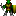

# Ultima 0.1  

In this assignment, you will be extending your previous Ultima 0 assignment. You will be implementing monsters using Java threads.	

---

**Getting started.** You can should use your previous Ultima 0 assignment as starting point for this assignment. Start by downloading [ultima0.1.zip](ultima0.1.zip). I added transparency to the monster tiles. I also changed the provided Ultima.java main program. The game text file format has also changed, so I've included a new set of text files. In your improved game, there are monsters you must go around and kill. You attack monsters by running into them. Monsters attack you in the same way. You can also walk on lava if you want, but it costs you one hit point.  

**Avatar.** The Avatar class has gotten somewhat more advanced. The Avatar now has a number of hit points (life). Once your hit points reach 0, the game is over and you lose. The Avatar has a damage amount, this is how many hit points of damage he causes when he attacks a monster. You will need to update your constructor to handle these new attributes.  

If the Avatar incurs damage (from a monster or from walking on lava), the new hit point value after the damage is displayed in yellow text over the Avatar image. The hit point display stay visible for approximately three seconds and then disappears. This will require you to modify your old draw() method. Your Avatar data type must implement the following additional API methods:  

<pre>
public class Avatar
----------------------------------------------------------------------------------------
            Avatar(int x, int y, int hp, int damage, double torch)  
        int getHitPoints()            // Get the number of hit points left
       void incurDamage(int damage)   // Reduce the Avatar's hit points by the amount damage
        int getDamage()               // Get the amount of damage the Avatar causes monsters
</pre>

The Avatar's line in the game text file now has 5 numbers, for example:  

<pre>11 2 20 3 100.0</pre>

The above means the Avatar starts at (11, 2), starts with 20 hit points, causes 3 hit points of damage, and has an initial torch radius of 100.  

**Tile.** A Tile class has only minor changes. Tile objects can now report the damage they cause if they are walked on. All tiles cause 0 damage except for lava which causes 1 point of damage.  

Here is the new API method:  

<pre>
public class Tile
-----------------------------------------------------------------------------------------
int getDamage()              // Return the damage caused by this type of Tile
</pre>

**Monster.** The Monster class represents a monster that roams around the World randomly. A monster knows things like its location, its remaining hit points, the amount of damage it causes when it attacks, and the type of monster it is. Monster objects also keep a reference to the World object so they can call methods in World from their run() method (namely the monsterMove() method). Just like the Avatar, if a monster is damaged it displays its remaining hit points in red text over the monster's image for approximately three seconds. If a monster's hit points are 0 or less, the monster has been killed and no longer is shown.  

Each monster is its own Java thread that, every so many milliseconds, attempts to move itself around the World. They are not smart, they just choose north, south, east or west at random. If they can move in the randomly chosen direction they do, otherwise they skip their turn and remain in the same location. If the monster randomly moves into your Avatar, you will lose hit points according to the damage attribute of the monster. Just like the Avatar, monsters cannot walk through walls, on water, or through mountains. Monsters can walk on lava, but it causes damage just as it does for the Avatar.

<table border="1" cellspacing="0" cellpadding="3">
<tr><td>Name</td><td>Filename</td><td>Image</td><td>Code</td></tr>
<tr><td>Skeleton</td><td><tt>skeleton.gif</tt></td><td></td><td>SK</td></tr>
<tr><td>Orc</td><td><tt>orc.gif</tt></td><td></td><td>OR</td></tr>
<tr><td>Slime</td><td><tt>slime.gif</tt></td><td></td><td>SL</td></tr>
<tr><td>Bat</td><td><tt>bat.gif</tt></td><td></td><td>BA</td></tr>
</table>

<pre>
public class Monster implements Runnable
-----------------------------------------------------------------------------------------
       Monster(World world, String code, int x, int y, int hp, int damage, int sleepMs)  
  void incurDamage(int damage)      // Reduce this monster's hit points by the amount damage
  void draw()                       // Draw the monster
   int getHitPoints()               // Get the number of remaining hit points of this monster
   int getDamage()                  // Get how much damage this monster causes
   int getX()                       // Get current x-position of this monster
   int getY()                       // Get current y-position of this monster
  void setLocation(int x, int y)    // Move this monster to a new location
  void run()                        // Worker thread that periodically moves this monster
</pre>

Monsters are defined at the end of the game text file. You can assume the values in the file are valid starting locations, monsters won't start on top of each other, on top of a mountain, etc. Here is an example:  

<pre>
SK  3   3   10  3 1000
OR  6   19  8   2 1000
BA  20  10  4   1 500
SL  25  16  6   2 1500
</pre>

The above defines:  
* Skeleton at (3, 3) with 10 hit points and which causes damage of 3. The skeleton attempts to move every 1000 ms.  
* Orc at (6, 19) with 8 hit points and which causes damage of 2. The orc attempts to move every 1000 ms.  
* Bat at (20, 10) with 4 hit points and which causes damage of 1. The bat attempts to move every 500 ms.  
* Slime at (25, 16) with 6 hit points and which causes damage of 2. The slime attempts to move every 1500 ms.  

**World.** The World class has a number of changes. The constructor must now parse a file with more information about the Avatar as well as information about the monsters. The World object must create and keep track of the Monster objects. Each monster is a thread, so you'll need to fire up one thread per monster. You will also need to implement two methods that handle attempting to move the Avatar or a Monster.  

</pre>
public class World
-----------------------------------------------------------------------------------------
 boolean avatarAlive()                               // Is the Avatar still alive?
    void monsterMove(int x, int y, Monster monster)  // Attempt to move given monster to (x, y)
    void avatarMove(int x, int y)                    // Attempt to move Avatar to (x, y)
     int getNumMonsters()                            // Return number of alive monsters
</pre>
     
The monsterMove() should be called by a monster's run() method. If the proposed location is not valid or not passable, then nothing happens. If there is currently another monster at the proposed location, then nothing happens (monsters don't attack each other). If the Avatar is at the proposed location, then the monster gets to attack the Avatar and do the appropriate damage. In this case, the monster stays at its current location (Avatar and monsters never overlap). Otherwise, the monster makes its move to the new location, incurring any damage associated with the new location (i.e. if the new location is lava). Note: since only the World object knows the outcome of the monster's call to monsterMove(), the World object must update the calling Monster object by calling setLocation() and/or incurDamage().  

The avatarMove() method should be called when the handleKey() method tries to move the Avatar. Similar to the monster, if the proposed location is not valid or passable, the Avatar stays put. If there is a monster at the location, the Avatar attacks it and the Avatar stays put. Otherwise, the Avatar moves to the new location incurring any damage associated with the new location (i.e. if the new location is lava).  

---

**Do I need to follow the prescribed APIs?** Yes. You may not add public methods to the API; however, you may add private methods (which are only accessible in the class in which they are declared).

**Why does monsterMove() get passed a monster object?** The monsterMove() method in the World class gets called by the monster's thread. In order for the method to do things like damage the monster for walking on lava or updating its location, it needs a reference to the object. While the monster run() method could do this, it could cause concurrency trouble.

**But how do I pass monsterMove() the monster object?** The run() method can use the this keyword which is a reference to the object running the method.

**How did you change the font for your hit point display?** StdDraw.setFont(new Font("SansSerif", Font.BOLD, 12));

**How do I display hit points for only three seconds?** We suggest you use the provided Stats class to measure the elapsed time from the last damage. Once the elapsed time is greater than three seconds, you no longer need to display the hit points.

**How do I test if I've handled concurrency correctly?** Try running the 30x30_full.txt world. This world has skeletons at all grid positions aside from the Avatar's position. The program shouldn't crash and the skeletons shouldn't end up on top of each other.

---

**Extra credit.** Make the game better.

---

This README was adapted from a page at Montana Tech: https://katie.cs.mtech.edu/classes/archive/s14/csci136/assign/ultima0.1/
