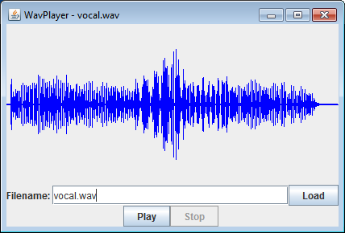
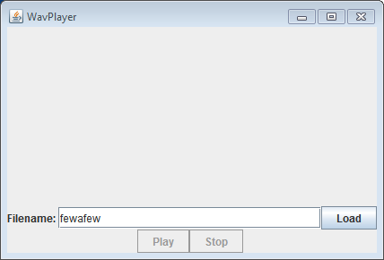

# WAV Audio Player  

You will be creating a Java GUI application that loads WAV format audio files. The application displays a waveform visual display of the audio and allows the user to playback the audio.	  

---

**Part 1: Creating the GUI.** Stub code and support files for this assignment are in [wavplayer.zip](wavplayer.zip). Your first job is to create the GUI application and arrange all your widgets. This can be done by adding code to WavPlayer.java. The panel containing the waveform will be blank until you add code to WavPanel.java in the next part. Here is a screenshot of what the interface should look like both with and without a valid loaded audio file:  

You will need to use a combination of layout managers and panels to achieve the above design. You may want to consult the MultiButtonsBox and BouncingBall examples. The waveform area will be the subclass of JPanel implemented in WavPanel.java. The other widgets rows will need to be grouped in there own JPanel objects.  

Part 1 requirements:  
* The window should default to 500x300 pixels.  
* The top part of the window contains a full width area for displaying the audio waveform.  
* Below the waveform appears a "Filename:" label, a text field for the filename, and a Load button.  
* At the bottom appear a Play and a Stop. These buttons are next to each other and centered horizontally.  
* The window is titled "WavPlayer" when no audio file is loaded.  
* When no audio is loaded, both the Play and Stop buttons are disabled.  
* Resizing the window should result in the components staying in their respective rows. The text field shrinks or expands to fill the available space between "Filename:" and the Load button. An excessively narrow window results in the text field disappearing to a line.  
* Closing the window should result in the application closing completely.  

**Part 2: Loading and drawing the waveform.** Users type the filename of their desired audio file in the text field and then hit enter or click the Load button. We assume the audio file given is a 44.1kHz, 16-bit, signed WAV file. You should use StdAudio.read() to read the file into the double [] sample array in WavPanel.java.  

Each audio sample is a double value between -1.0 and +1.0. Draw a line at each x-coordinate with a height that is proportional to the absolute value of the audio sample value. So for example, if a sample was 1.0, it would be a blue line going from the bottom of the panel to the top. A sample value of 0.0 would be a dot in the middle of the panel. The audio will contain many more samples than the number of pixels of width of your panel. Thus for each x-coordinate, you will need to map it to a much bigger index into the sample array. You can simply use one audio sample to determine the waveform height at a given x-coordinate. You do NOT need to do anything fancier (such as taking an average).  

Part 2 requirements:  

* A file can be loaded by pressing the Load button or by hitting enter in the filename text field.  
* When no audio is loaded, both the Play and Stop buttons are disabled.  
* When audio is loaded, the Play should be enabled.  
* Attempting to load a non-existent or invalid audio file results in the waveform display being blank, the Play button being disabled, and the window title should be "WavPlayer"  
* The window title should change to "WavPlayer - foo.wav" when the audio file foo.wav is loaded.  
* Resizing the window should result in the waveform being expanded or contracted horizontally and vertically.  
* The waveform should appear in blue. An audio level of 0 is drawn in the center of the waveform's panel.  
* The waveform, regardless of its length, should span the horizontal width of the window.  

**Part 3: Playing the audio.** Allow the user to play a valid loaded audio file by hitting the Play button. During playback, a red line will scroll from left to right through the waveform display in synchronization with the currently playing audio sample. You can play an individual audio sample using StdAudio.play(double). During playback, the only widget that can be used is the Stop button. If the Stop button is hit, playback immediately stops and the red line disappears.  

In an event listener such as the one for your Play button, no changes to other widgets (such as your waveform canvas) will be visible until after the listener finishes. Thus you simply cannot loop over all the samples and call repaint() repeatedly on your waveform canvas in the Play button handler. You will need to spin up a worker thread to do this. You'll need to be careful so the worker thread can respond to a request to stop playback via the Stop button.  

Part 3 requirements:

* When no audio is loaded, both the Play and Stop buttons are disabled.  
* When audio is loaded but when playback is not active, the Play button is enabled but the Stop button is disabled.  
* When audio is playing, the Play button, Load button and the filename text field are disabled.  
* When audio is playing, a red line shows the current playback position in synch with the audio.  
* When audio is playing, the Stop button is enabled and if clicked, causes playback to immediately stop and the red line to disappear.  
* When audio is not playing, no red line appears in the waveform display.  
* My program crashes if the user attempts to load an invalid file. Is that okay? No. The StdAudio read method throws a RuntimeException if it fails to load a file. You need to catch this exception and return false from your load method.  

---

**My text field is super tall and looks silly. How do I prevent that?** For a widget in a BoxLayout, you can specify a maximum size using the setMaximumSize method.  

---

**Extra credit.** Add additional features to the program such as:  

* Start with the Load button disabled. Only enable the button once they type a filename that is a file that exists (but may not necessarily be valid).  
* If a command-line argument is given, pre-populate the text field with that value and attempt to load the waveform.  
* Allow users to use their mouse to highlight a portion of the waveform by holding down the button and dragging left or right. If such a portion is highlighted, make Play only play that section. If the user single clicks in the waveform area without dragging, reset to playing the whole waveform.  
* Add a checkbox that causes the playback to be done in reverse.  
* Add a slider widget that adjusts the gain on the audio, causing a multiplicative increase or decrease in sample values. Update the waveform display live as the user drags around the slider.  
* Create a label that displays the sample value and time offset of the user's current mouse x-position in the waveform.  

---

This README was adapted from a page at Montana Tech: https://katie.cs.mtech.edu/classes/archive/s14/csci136/assign/wav/  
