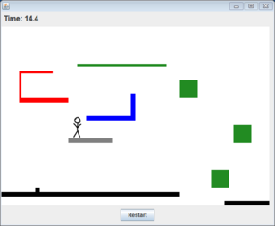
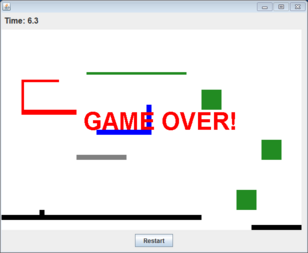
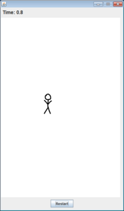
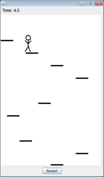

# The Adventures of Stick Man  

You will be creating a Java GUI game in which you guide a stick man around. You will gain additional experience buildings Java GUIs and also with object inheritance. You will also be extending the game to add your own special game features. Exactly what features you add and how you do it is up to you!  

---

**Overview.** The stick man lives in a world where gravity pulls him downwards. If he falls off the bottom of the screen he dies and the game is over. Lucky for stick man, he can reincarnate by pressing a "Restart" button. The stick man has special physic defying powers that let him move left or right even while falling. There are various platforms the stick man can walk left and right on. He cannot walk through any of the rectangular platform objects. He also cannot walk off the screen to the left or right (even if nothing blocks his way).  

**Getting started.** Stub code and support files for this assignment are in [stickman.zip](stickman.zip). We've given you a complete working implementation of the abstract base class Rectangle You will be developing two subclasses of this class Platform and Man as well as the main program StickMan. We have not provided any implementation for the other classes, you need to decide on the design of your classes. You may add other classes as well if you think it would be helpful. You should be sure to comment your instance variables, methods, and classes so another programmer can easily figure out what you did and why.  

We've given you four different sized images of the stick man:  

 
 
 
  
			
Your main Java application will be in the class StickMan. The StickMan program takes a single command-line argument, namely the level control file. We've also given you three level files: [stick0.txt](stick0.txt), [stick1.txt](stick1.txt), and [stick2.txt](stick2.txt). Here is the start of the first control file:  

<pre>
600 400
140 5 stick20.png
10
1 2

0 370 400 10 0 0 0
...
</pre>

The first line specifies that the playing area of the game window will be 600 pixels by 400 pixels. The second line says the stick man should start at (140, 5) and should use the image file stick20.png. The third line says that there is a 10 millisecond delay between each update of the game. The fourth line says that the stick man moves 1 pixel at a time horizontally and 2 pixels at a time vertically (i.e. when falling). Following this are 0 or more lines containing integers specifying the location, size and color of the level's platforms. In this case, there is one at (0, 370) that is 400 pixels wide and 10 pixels high. The platform is black since the RGB triple consists of the three integers 0, 0, 0.  

Here is what our game looks like loading the three different level files as well as when the stick man has died:

 stick0.txt 
 stick0.txt 
 stick1.txt
 stick2.txt  

**Game details.** Your StickMan application should take a single command-line argument for the level file to load. You can assume the level file will be well formed and the given image filename is valid. The total time of the game in seconds and tenths of a second should be displayed as a text label at the top-left of window. The timer should only continue to increment if the stick man is alive. After death, the timer shows the elapsed lifetime of the previous stick man.  

If the stick man isn't currently intersecting a platform rectangle, he will fall downwards. This will happen at the rate specified in the control file. Once his head is completely off the bottom of the screen, "GAME OVER!" should be displayed in the middle of the screen in giant red text. A button labeled "Restart" should centered and at the bottom of the window. Hitting the button immediately aborts any current game, resetting the game to the state specified by the level file. The timer should restart from 0.  

The stick man should move left or right if the last known mouse position in the game area was to the left or right of the stick man's image. If the mouse x-position was inside the stickman's bounding box, the stickman doesn't move in either direction. If the mouse cursor moves outside the JPanel containing the game, the stick man continues to move in the direction dictated by the last position in the panel. This ensures you can control the stick man even at the edge of the playing area.  

You should disable resizing of your JFrame by using the setResizable method. The size of your window should depend on the size of the game panel specified in the control file. To do this, you will need to call setPreferredSize on your custom JPanel that draws the game. After adding all the GUI widgets to the JFrame, you can make it size itself appropriately by calling the pack method. Make sure hitting the close box of your game window makes the application terminate.  

**Improving the game.** The game currently is a bit boring and there is no way to win. Part of your assignment is to add your own new and exciting twist(s) to the game. You get to decide what to do and how to implement it. Here are some ideas:  

* Allow the stick man to jump  
* Add items that need to be collected by the stick man  
* Make special platforms that gradually disintegrate when the stick man is on them  
* Make special platforms that explode if touched  
* Make special platforms that move from left to right or up and down  
* Animate the actions of the stick man  
* Allow the stick man to crouch down to get through tight spots  
* Add moving enemies that try and kill stick man  
* Make the game progress through a series of level files  
* Add UI widgets to control different aspects of the game such as speed, gravity, etc.  
* Add a time limit in which the stick man must achieve his objective (e.g. collecting things, reaching a certain point, etc.)  

5 of the 30 points for the assignment will be allocated to features that go beyond the basic version of the game. We will be grading this based on: the difficulty of added features, creativity of your features, and implementation elegance. You should describe in detail your new features in the header of StickMan.java. If you are unsure whether your additions are sufficient to warrant full-credit, talk to me. You are allowed to add or change the format of the control files if necessary, just be sure to submit everything we need and tell us how to run it!  

---

**Extra credit.** Add features that go above and beyond the call of duty.

---

This README was adapted from a page at Montana Tech: https://katie.cs.mtech.edu/classes/archive/s14/csci136/assign/stickman/
