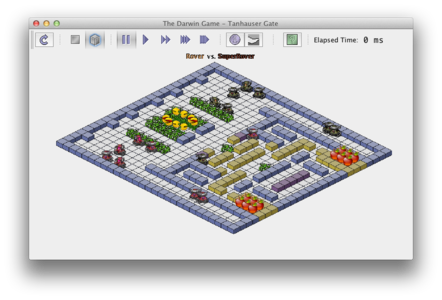

# Dueling Creatures  

You will be designing an artificial intelligence to solve a specific problem. In the process, you will gain experience working with external documentation and libraries. While I encourage you to help each other, especially early on in the assignment, I want an individual unique creature submitted from every student (i.e. this is not a paired assignment).  

  

---

**Overview.** We will be using the [Darwin 2.2 game simulator](https://morgan3d.github.io/darwin/) from Williams College. You should start by downloading the [zip file](https://morgan3d.github.io/darwin/darwin2.2.zip). Inside the zip is the [player's handbook](https://morgan3d.github.io/darwin/players-handbook.pdf). You should read the player's handbook and also try out the simulator on some of the provided sample maps and creatures. The [online JavaDoc](https://morgan3d.github.io/darwin/doc/package-summary.html) will also be an important resource. Between the player's handbook and the JavaDoc, you should be able to find out whatever you need to know in order to develop your Creature.  

If you would like to edit your creature file in Eclipse, you'll want to setup an Eclipse project as normal. But you will need to add the darwin.jar file to your project properties. Right-click on your project name, select project properties, Java Build Path, Libraries tab, Add External JARs, and then navigate to the darwin.jar file.  

**Details.** You can name your creature whatever you like, but add a suffix of your initials (e.g. KillerKV.java). This class will extend the Creature class and you will implement your creature's AI in the run() method. This method should be an infinite loop and will continue to execute as long as that instance of the creature is still alive. The run method will call various methods inherited from the Creature superclass (e.g. moveForward(), turnLeft()). See the JavaDocs for all the things you can make your Creature do.  

It is up to you exactly what strategy your Creature will implement. But in order to get full credit, I expect sophistication beyond the simple approaches of Rover, SuperRover, and FlyTrap. Some features you might consider:  

* Sharing information using static instance variables
* Building a map
* Changing strategies if you detect that you are losing
* Shortest-path finding
* State-machine AI, e.g. explore-attack-defend
* Emergent behavior, e.g. pack formation (herding)
* Timing attacks and escapes
* Early-, mid- and late-game strategies  

**Writeup.** You are required to submit a document describing the design of your creature. This could be done as a .txt, .pdf, Word document, or as a well-formatted comment at the top of your creature's source code. I want to see the following:  

* Strategy of your creature.
* Advantages and disadvantages to your strategy (e.g. What types of maps does it work well/poorly on? What types of adversaries do you expect it to work well/poorly on?)
* Data structures/algorithms used to support your strategy and why you chose them.  

**Design advise.** There are many possible approaches to the game. You could for example develop a creature that is completely defensive, hiding in a corner herded together with others of its own species. You could devise a creature that lays a trap, waiting for other creatures to enter its "kill zone". You could make a hunter that looks around and when it sees an enemy, approaches and attacks. The sky is the limit.  

Whatever your overall plan, you should start simple and implement various helper methods. For example, a method to walk to a certain location, a method to observe in all directions, etc. Once you have developed and tested such helper methods, you can combine them to help realize your overall strategy. You will be penalized for submitting one giagantic run() method!  

To start, I recommend that you design a state machine for your creature. Creatures can change states based on their own experience or communication via other members of their own species (via static instance variables). Avoid hard coding constants into your program. A well-designed creature will have a large number of named constants at the top that control various probabilities, timeouts, and movement costs. You should also be using the constants declared in the Simulator and Creature classes rather than duplicating them in your own code.  

---

**The tournament.** The tournament will be conducted during class on Friday May 3rd. Your grade will NOT depend on your creature's performance during the tournament. Rather your submission will be graded on how well your creature demonstrates your command of course material. Does the code use appropriate data structures and algorithms to achieve its aims? Is the code easy to read and understand? Is the code easy to maintain or extend?  

You must submit your creature by the assignment's regular due date and time (Thursday 10PM) to be eligible for the tournament. So if you are using late days on this final assignment, you won't be able to compete.  

Tournament specifics:
* I will devise my own faceoff map for the tournament.  
* It will be a two-player head-to-head faceoff.  
* The map may have apples, hazards, flytraps, and walls.  
* The map will NOT have shrines, enchanted apples, mud, or fog.  
* The initial spawn will consist of at least two creatures for each player, players will get the same number of initial creatures.  
* You are NOT allowed to try and attack the simulator's security.  
* The winner of the student tournament will earn 10 points added on top of their normal course assignment total.  
* If the winner defeats both my creature and Justin's creature, that student will earn an additional 5 points.  

All the icons for the creatures that come in the Darwin jar are also in [images.zip](images.zip).  

---

Submission. Submit a single zip file containing:  
* A Java source file with your Creature, e.g. KillerKV.java  
* Four PNG image files named as described in the player's handbook, e.g. KillerKV-N.png, KillerKV-S.png, KillerKV-E.png, KillerKV-W.png. You do NOT have to create your own image set- you can copy an existing set or [download something](http://spritedatabase.net/). Just make sure it works.  
* Writeup document (if not included in the header of your source file)  
* (optional) Winning WAV sound file  
* Name the zip file after your creature name and initials, e.g. KillerKV.zip  

Be sure your submitted source file has the required header with your name, username, and a description of the program.  

---

*This assignment is based on one by [Morgan McGuire](https://www.cs.williams.edu/~morgan/) at Williams College.*

---

This README was adapted from a page at Montana Tech: https://katie.cs.mtech.edu/classes/archive/s14/csci136/assign/darwin/
